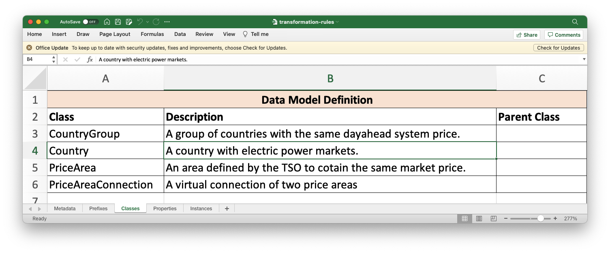
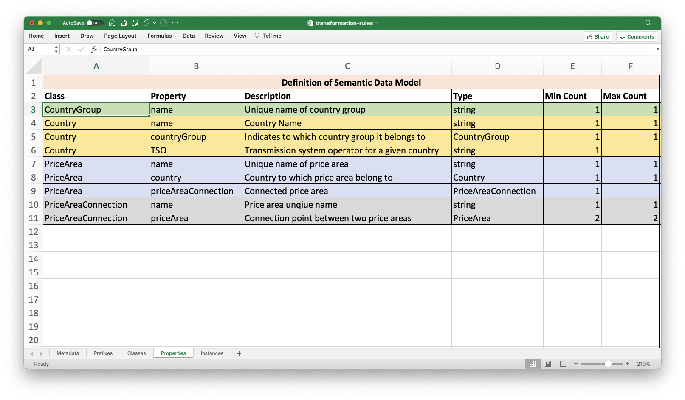
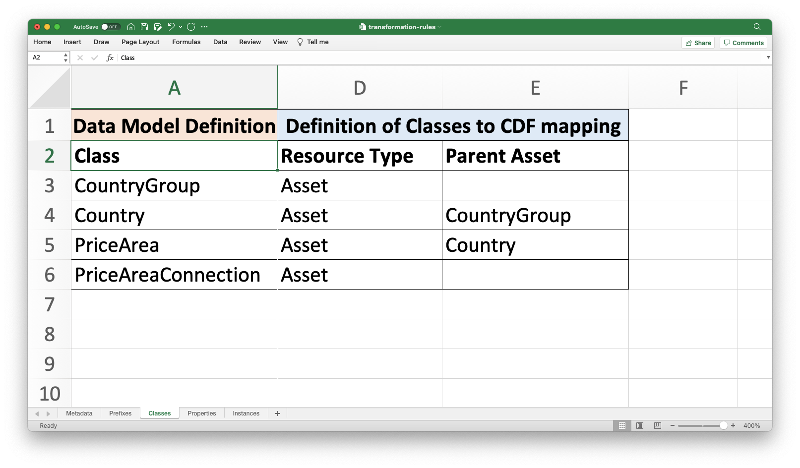
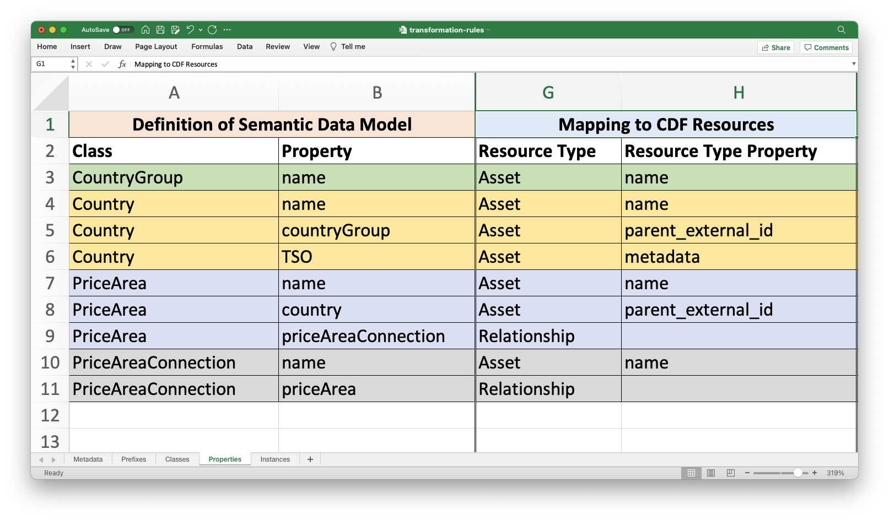
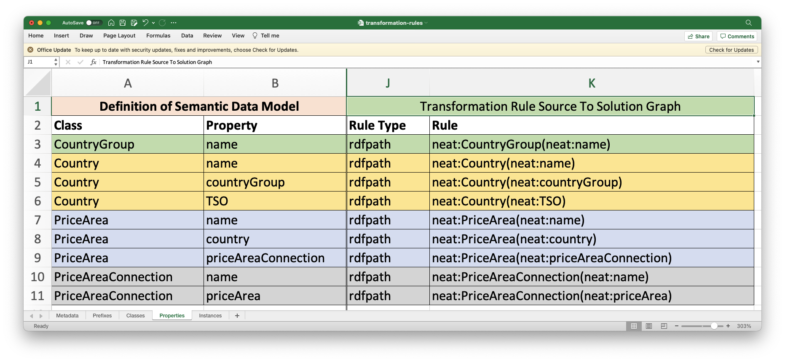
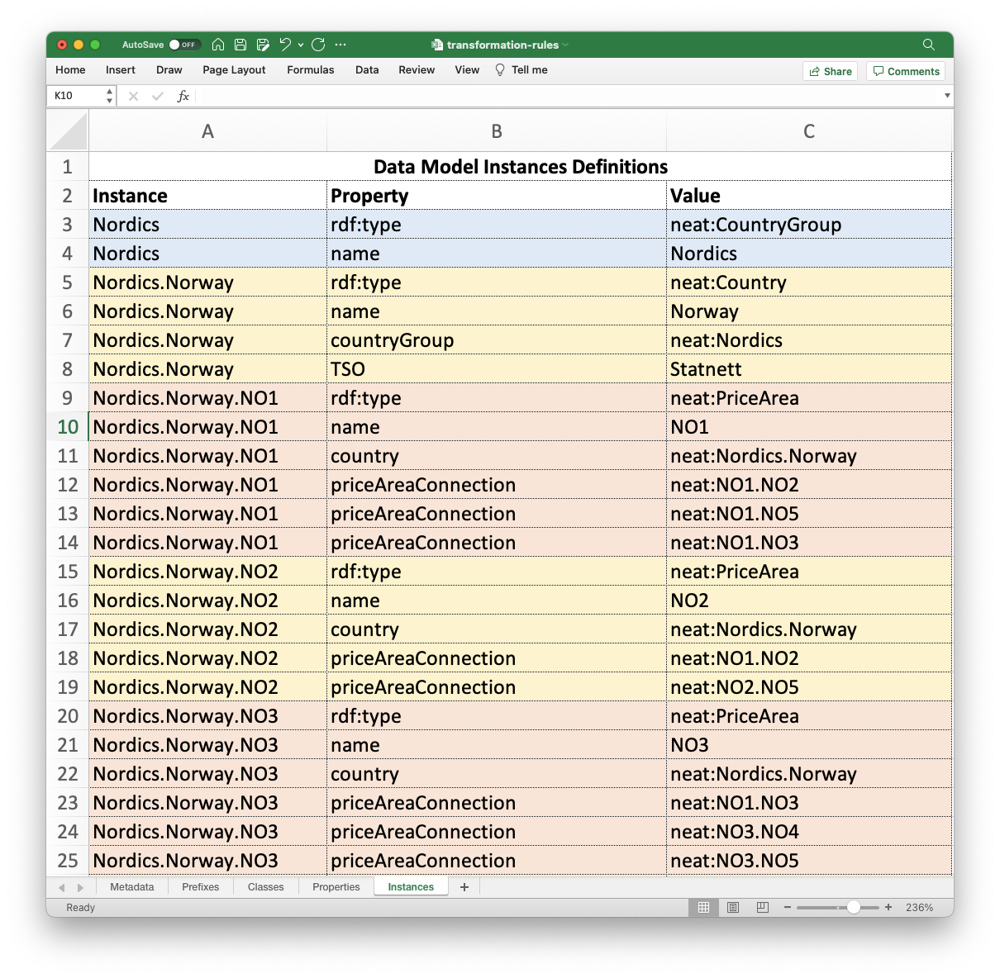

# Transformation Rules
`Transformation Rules` is an Excel template which provides simple and intuitive way to create a semantic data model and optionally knowledge graph. As it can be shared via for example SharePoint or as Google Sheets, multiple people can jointly collaborate and work on same data model. It is a great tool for onboarding of domain experts to the semantic information modeling and knowledge graphs.

`Transformation Rules` contains following sheets:
- `Metadata`: contains metadata about the data model
- `Prefixes`: contains the definition of the prefixes that are used in the semantic data model and knowledge graph
- `Classes`: contains the definition of the classes that are part of the semantic data model as mapping of those classes to CDF resources such as Assets
- `Properties`: contains the definition of the properties that are part of the semantic data model, mapping of those properties to CDF resources and mapping of source data model and knowledge graph to the data model and knowledge graph that are being defined in the `Transformation Rules` (aka solution or target data model and knowledge graph)
- `Instances`: contains the definition of the instances of the classes that are part of the semantic data model

Instead of explaining each sheet on its own we will explain how each part of the `Transformation Rules` is used to define:
- semantic data model
- semantic data model to CDF resource mapping
- source to solution data model and knowledge graph mapping
- semantic data model instances (aka knowledge graph)


## Semantic Data Model Definition
First we start with the semantic data model definition. `Metadata` sheet contains metadata about data model. From the screenshot below one can see that the `Metadata` sheet is in a form of key value pairs. The `Key` column contains the name of the metadata attribute and the `Value` column contains the value of the metadata attribute. The metadata attributes are as follows:

- `shortName`: short name of the data model which is used as a prefix for the identifiers of the classes and properties and potentially as a prefix for the identifiers of the instances of the classes. This attribute is mandatory.
- `version`: version of the data model. This attribute is mandatory.
- `isCurrentVersion`: indicates whether or not the current `Transformation Rules` holds the current version of the data model definitions. This attribute is mandatory.
- `created`: data model creation date. This attribute is mandatory.
- `title`: title of the data model, usually more descriptive than the `shortName`. This attribute is mandatory.
- `description`: short description of the data model. This attribute is optional but strongly advised.
- `abstract`: more detailed description of the data model. This attribute is optional.
- `creator`: creators of the data model separated by comma. This attribute is mandatory.
- `contributor`: contributors to the data model separated by comma. This attribute is optional.
- `rights`: usage right of the data model. This attribute is optional but strongly advised.
- `dataSetId`: CDF dataset id where the data model will be ingested. This attribute is mandatory.
- `externalIdPrefix`: any prefix that will be added to CDF resource external identifies, this is to avoid conflicts with the identifiers since CDF does not allow the same external identifier to be used for different resources even if they are in different datasets. This attribute is optional, and typically used in development phase of the data model, when multiple users are ingesting the same data model/knowledge graph into CDF.


`Prefixes` sheet contains the definition of the prefixes that are used in the semantic data model and knowledge graph.

`Classes` sheet contains the definition of the classes that are part of the semantic data model. It is strongly advised to use `PascalCase` for the class names.



`Properties` sheet contains the definition of the properties that are part of the semantic data model. This sheet contains more granular look on the semantic data model as properties are defined per each class including their cardinality and type of value they can hold. Therefore, in this sheet we are actually defining specific shape of classes.


Let's take a look at the screenshot below and define what each column means:

- `Class`: name of the class that the property belongs to. This attribute is mandatory. Class must be defined in the `Classes` sheet.
- `Property`: name of the property. This attribute is mandatory. It is strongly advised to use `camelCase` for the property names.
- `Description`: short description of the property. This attribute is optional, but strongly advised.
- `Type`: type of the value that the property can hold. This attribute is mandatory. It takes either XSD type (simple types such as `string`, `float`, etc.) or a class defined in the `Classes` sheet (complex types).
- `Min Count`: minimum number of values that the property can hold. If no value is provided, the default value is `0`.
- `Max Count`: maximum number of values that the property can hold. If no value is provided, the default value is `inf`.



Combination of `Min Count` and `Max Count` attributes defines the shape of the property. The following table shows the possible combinations and their meaning:

| Min Count | Max Count | Meaning |
|-----------|-----------|---------|
| Not provided         | 1         | Optional single value property |
| Not provided         | None       | Optional multi value property |
| 1           | 1         | Mandatory single value property |
| 1           | Not provided       | Mandatory multi value property |


In the screenshot above we can see that we defined:

- `name` property for all classes as mandatory single value property that holds values of type `string`
- `TSO` property as mandatory multi value property that holds values of type `string`
- `priceArea` property as mandatory property which hold minimum two and maximum two values of type `PriceArea` (i.e., two references to instances of `PriceArea` class)

The definitions in the sheets above are converted by `NEAT` into the semantic data model in the form of [RDF triples](https://www.oxfordsemantic.tech/fundamentals/what-is-a-triple). Specifically, `NEAT` produces [OWL](https://en.wikipedia.org/wiki/Web_Ontology_Language), which holds meaning of classes and properties, and [SHACL](https://en.wikipedia.org/wiki/SHACL) which holds structure of classes. Both `OWL` and `SHACL` are W3C standards.


## Semantic Data Model to CDF Resouces Mapping
`Classes` and `Properties` sheets contain also columns that define how semantic data model instances (aka knowledge graph) are transformed/mapped to CDF resources specifically in this example CDF `Assets` and `Relationships`.





## Source to Solution Data Model and Knowledge Graph Mapping
In typical scenario we would have knowledge graph, to which we would relate as `Source Graph` and we would perform transformations to `Solution Graph` which would be then mapped to CDF Resources. This mappings are defined in the `Properties` sheet of the `Transformation Rules` file, as one can see below:



Various types of mappings are are defined in [Rule Type](./rule-types) section of this documentation. Make sure to check them out.

## Semantic Data Model Instances Definition
`Instances` sheet contains the definition of the instances of the classes that are part of the semantic data model.These instances are building blocks of the knowledge graph. Let's take a look at the screenshot below and define what each column means while as well looking at couple of rows. In the screenshot below we see three columns:

- `Instance`: this column defines URIs (aka unique identifier or references) of the class instances
- `Property`: this column defines property of the class instances
- `Value`: this column defines value of the property of the class instances

Each row forms so-called triple or RDF statement when processed by `NEAT`. For example we read first row as:
```
Nordics is an instance of class CountryGroup
```

which is translated into RDF triple (assuming that `neat` is the prefix of the data model being defined by the `Transformation Rules` file):
```
<http://purl.org/cognite/neat#Nordics> <http://www.w3.org/1999/02/22-rdf-syntax-ns#type> <http://purl.org/cognite/neat#CountryGroup>
```

or if rewritten in a more human readable form:
```
neat:Nordics rdf:type neat:CountryGroup
```



Those who are familiar with RDF will notice that `Instance` column holds information on `subject`, `Property` column holds information on `predicate` and `Value` column holds information on `object` of the triple. Furthermore, in case of of `Instance` and `Property` rows it is not mandatory to specify `prefix` of data model being defined by the `Transformation Rules` file. This is because `NEAT` will automatically add it and form URI (e.g., `http://purl.org/cognite/neat#Nordics`). Prefix is only added in case of `rdf:type` property, since `rdf` is define outside this particular `Transformation Rules`.

On the other hand, `Value` column can contain either literal values or URIs (i.e. references). Due to this, if `Value` column holds references user must provided them either in the prefix form (e.g. `neat:CountryGroup`) or by providing entire URI (e.g., `http://purl.org/cognite/neat#CountryGroup`).

Statements that describe same instance represent so-called `named graph` in RDF, for example when `NEAT` processed rows 5-8 it will form named graph with URI `http://purl.org/cognite/neat#Nordics.Norway` containing triples:
```
PREFIX neat: <http://purl.org/cognite/neat#>
PREFIX rdf: <http://www.w3.org/1999/02/22-rdf-syntax-ns#>

neat:Nordics.Norway rdf:type neat:Country;
                    neat:name "Norway" ;
                    neat:TSO "Statnett" ;
                    neat:countryGroup neat:Nordics .
```
This form of RDF data is known as [Turtle](https://www.w3.org/TR/turtle/), which is one of the most popular RDF serialization formats due ot its readability. One of the authors of `Turtle` or `TTL` is Tim Berners-Lee, the inventor of the World Wide Web.

The knowledge graph is thus composed of one or more named graphs, where each named graph represents an instance of the class that is part of the semantic data model.

It is **not advise** to over use this sheet to define knowledge graph, but to use it only for:
- insertion of missing triples to your already existing knowledge graph
- or for testing purposes
